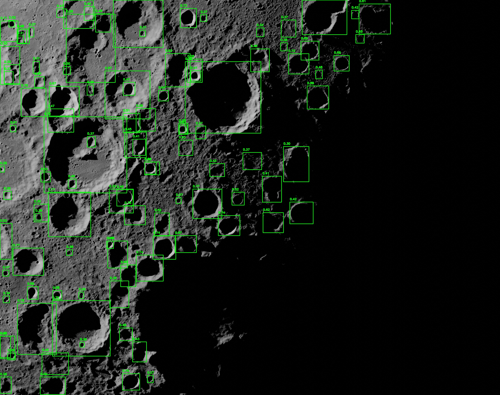
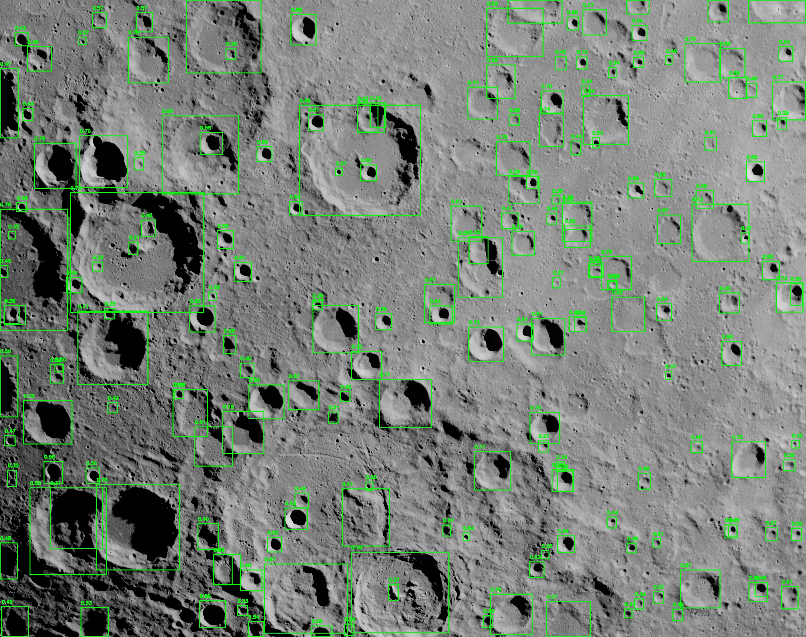
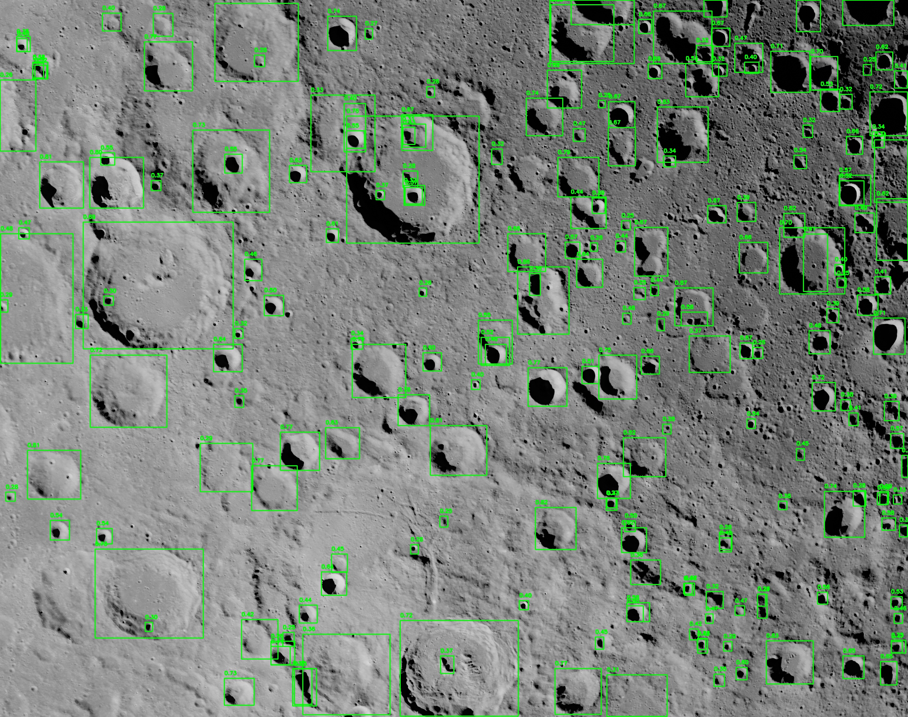

# 🌓 MCAD - Multiscale Crater Analysis and Detection

**MCAD** is a command-line interface (CLI) for detecting lunar craters in satellite imagery using a custom-trained YOLOv8 model. 
It supports single-image, full directory and recursive batch directory processing. MCAD also provides an interactive shell
for repeated use. Built for lunar research and detection tasks, MCAD simplifies AI-based crater detection into a 
user-friendly CLI.

---

## 📁 Project Structure
```
jams/
├── app/
│   ├── backend/
│   │   └── system/
│   │       ├── best.pt
│   │       └── YOLOv8MCAD.py
│   └── frontend/
│       ├── ascii_image.py
│       ├── cli.py
│       ├── mcad_nasa.png
│       ├── mcad_nasa_colored.txt
│       ├── nasa_logo.png
│       └── nasa_logo_colored.txt
├── README.md
├── requirements.txt
└── structure.txt
```
---
## 🛠️ Development Note

Since I developed the CLI using the PyCharm IDE, the project directory `jams` is located inside the default `PycharmProjects` folder (i.e. `~/PycharmProjects/jams`).

If you are using a different IDE or directory structure, you may place the project wherever you prefer, as long as you navigate to the root `jams/` folder before running or modifying the code.

**System Specs:**  
- Developed on: macOS 15.0 - 15.3.1  
- Python Version: 3.11  
- IDE: PyCharm (Professional Edition)
---

## ⚙️ Installation
### 1. Download the project
- Download the zipped MCAD project folder
- Extract the contents to a location of your choice (e.g. ~/PycharmProjects/jams)

### 2. Navigate to the project directory
```bash
cd ~/PycharmProjects/jams
```

### 3. Create and activate the virtual environment

 - Assuming the user is already inside the `jams/` directory:
```bash
python3 -m venv .venv
```
```bash
source .venv/bin/activate
```

### 4. Install dependencies
```bash
pip install -r requirements.txt
```

---
## If the terminal is restarted, activate the virtual environment again before running the main CLI or interactive shell
```bash
source ~/PycharmProjects/jams/.venv/bin/activate
```

## 🚀 Usage in main CLI
### ➤ Run the main CLI
```bash
python cli.py
```

### ➤ Detect a single image
```bash
python cli.py detect /path/to/image.png --output custom_folder_name
```

### ➤ Batch detect with recursive mode
```bash
python cli.py batch_detect /path/to/folder/ --recursive --output custom_folder_name
```
## 🚀 Usage in interactive shell
### ➤ Run the interactive shell
```bash
python cli.py shell
```

### ➤ Detect a single image
```bash
detect /path/to/image.png --output custom_folder_name
```

### ➤ Batch detect with recursive mode
```bash
batch_detect /path/to/folder/ --recursive --output custom_folder_name
```

> By default, detection results (annotated images and YOLO `.txt` files) are 
> saved to a folder named `Yolo Results` unless `--output` is specified in which you 
> can customize the output folder name.

---

## 🧪 Commands and Flags

| Command        | Description                                  |
|----------------|----------------------------------------------|
| `detect`       | Detect craters in a single image or folder   |
| `batch_detect` | Detect craters recursively in subdirectories |
| `shell`        | Launch interactive CLI shell                 |
| `exit`, `quit` | Exit the CLI shell                           |

**Available Flags:**
- `--output`: Set output folder (default: `Yolo Results`)
- `--model`: Use custom YOLO model (default: `best.pt`)
- `--recursive`: Enable recursive search (for `batch_detect` only)

> By default, the crater detection model is set to `best.pt` but can be customized by including the flag `--model` followed by the crater detection model name.
> Such as `detect /path/to/folder/ --model newModel.pt` or omit the `--model` flag to use the default crater detection model.

---

## 📂 Detection Results Output

After running crater detection using the `detect` or `batch_detect` commands, the results will be saved to the following location by default:

### jams/app/frontend/Yolo Results/

Your folder will contain:
- ✅ The annotated lunar images (with crater bounding boxes drawn) as shown below

- 📝 YOLO-formatted `.txt` files for each processed image

    - YOLO-formatted `.txt` file contains the following 6 columns from left to right:

        - (1) **class_id** ← represents a single class (such as a crater in this case); refers to the category of the object being detected
        - (2) **center_x**, (3) **center_y** ← represents the **normalized coordinates of the center** of the bounding box in the range of 0 to 1, relative to the image width and height
        - (4) **width**, (5) **height** ← represents the **normalized width and height** of the bounding box, again in the range of 0 to 1, relative to the image dimensions
        - (6) **confidence_score** ← indicates the **model's certainty** that the detected object belongs to the specified class, represented as a **floating-point number** between **0** and **1** (i.e. 0.826847 **≈** 82.68%)


> You can customize the output folder name using the `--output` flag.
>
> Example:  
> `detect /Users/joshuajackson/Downloads/mcad_moon_data/025/ --output 025`  
> `--output 025` ← saves results in `jams/app/frontend/025/`
> 

---

## 🧠 Crater Detection Model

MCAD uses a custom YOLOv8 model (`best.pt`) trained to detect craters across various lighting conditions and scales in lunar surface images. 
This file is stored at:

```
jams/app/backend/system/best.pt
```

---

## 📸 Screenshots








---

## 📜 License

This project is part of a senior design collaboration with NASA and may be subject to intellectual property or licensing policies from NASA or Prairie View A&M University.

Please contact the project lead or university representative before using or redistributing this code.

---
## 👤 Documentation Author

**Joshua Jackson**

### 💻 Project By

**Team JAMS**  
*Joshua Jackson, Anthony Pham, Marc Mata, Sukhraj Singh*  
Senior Design Project 2024 - 2025 · Prairie View A&M University


